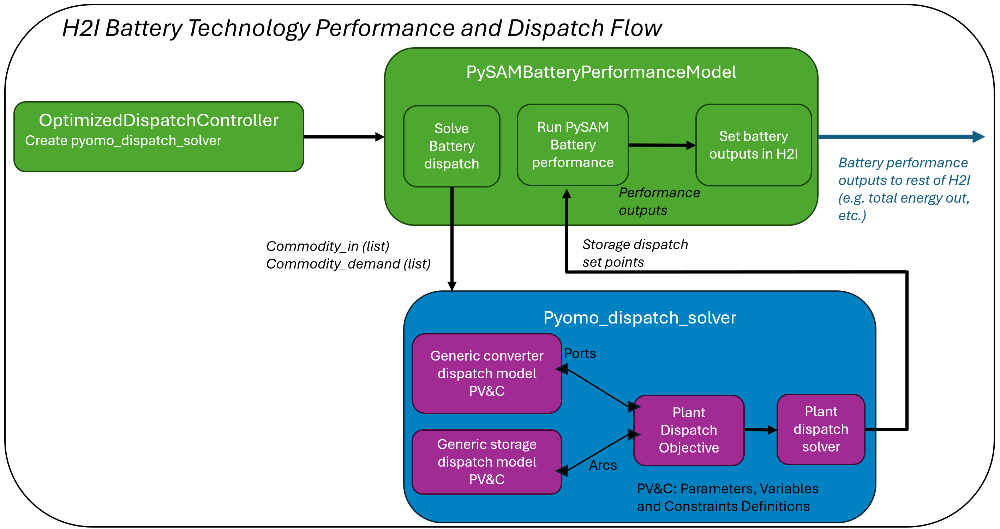
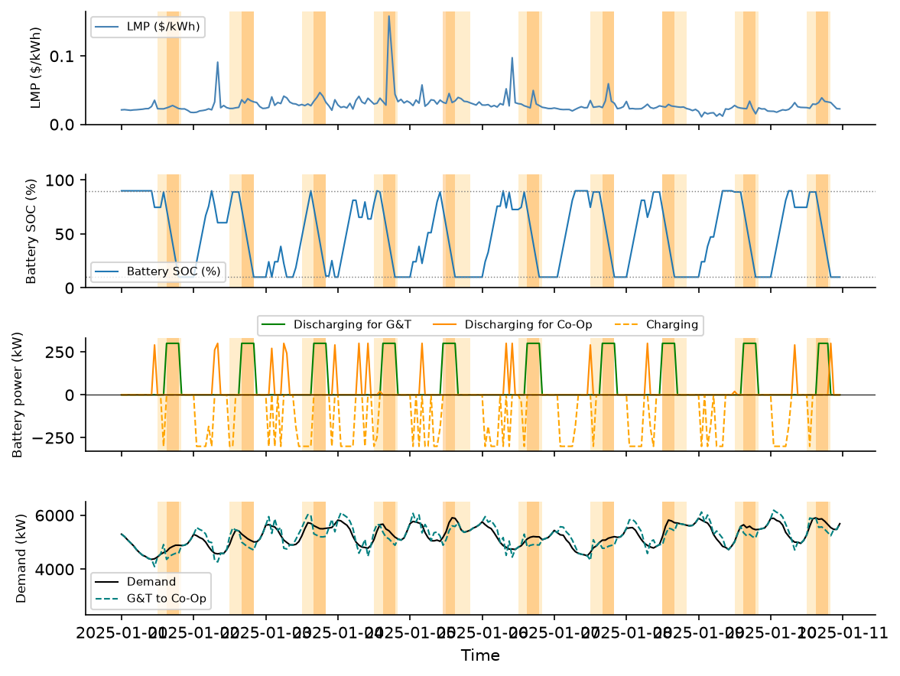

---
jupytext:
  text_representation:
    extension: .md
    format_name: myst
    format_version: 0.13
    jupytext_version: 1.18.1
kernelspec:
  display_name: Python 3.11.13 ('h2i_env')
  language: python
  name: python3
---

(pyomo-control)=
# Pyomo control framework
[Pyomo](https://www.Pyomo.org/about) is an open-source optimization software package. It is used in H2Integrate to facilitate modeling and solving control problems, specifically to determine optimal dispatch strategies for dispatchable technologies.

Pyomo control allows for the possibility of feedback control at specified intervals, but can also be used for open-loop control if desired. In the Pyomo control framework in H2Integrate, each technology can have control rules associated with them that are in turn passed to the Pyomo control component, which is owned by the storage technology. The Pyomo control component combines the technology rules into a single Pyomo model, which is then passed to the storage technology performance model inside a callable dispatch function. The dispatch function also accepts a simulation method from the performance model and iterates between the Pyomo model for dispatch commands and the performance simulation function to simulate performance with the specified commands. The dispatch function runs in specified time windows for dispatch and performance until the whole simulation time has been run.

An example of an N2 diagram for a system using the Pyomo control framework for hydrogen storage and dispatch is shown below. Note the control rules being passed to the dispatch component and the dispatch function, containing the full Pyomo model, being passed to the performance model for the battery/storage technology. Another important thing to recognize, in contrast to the open-loop control framework, is that the storage technology outputs (commodity out, SOC, unused commodity, etc) are passed out of the performance model when using the Pyomo control framework rather than from the control component.

Open `h2i_n2.html` in a browser to explore model groups, components, and variable connections.

```{code-cell} ipython3
:tags: [remove-input]

from h2integrate.core.h2integrate_model import H2IntegrateModel
import openmdao.api as om
import os

import html
from pathlib import Path
from IPython.display import HTML, display

# Change to an example directory
os.chdir("../../../examples/18_pyomo_heuristic_dispatch/")

# Build and set up the model
h2i_model = H2IntegrateModel("pyomo_heuristic_dispatch.yaml")
h2i_model.setup()

# Write interactive N2 HTML diagram
om.n2(
    h2i_model.prob,
    outfile="h2i_n2.html",
    display_in_notebook=False, # set to True to display in-line in a notebook
    show_browser=False, # set to True to open in a browser at run time
)

n2_html = "h2i_n2.html"
n2_srcdoc = html.escape(Path(n2_html).read_text(encoding="utf-8"))
display(
    HTML(
        f'<div style="width:100%; height:600px; overflow:auto; margin:0; padding:0; border:0;">'
        f'<iframe srcdoc="{n2_srcdoc}" '
        'style="display:block; width:200%; height:600px; border:0; margin:0; padding:0; background:transparent;" '
        'loading="lazy"></iframe>'
        '</div>'
    )
)
```

The Pyomo control framework currently supports both a simple heuristic method and an optimized dispatch method for load following control.

(heuristic-load-following-controller)=
## Heuristic Load Following Controller

The simple heuristic method is specified by setting the storage control to `HeuristicLoadFollowingStorageController`. When using the Pyomo framework, a `dispatch_rule_set` for each technology connected to the storage technology must also be specified. These will typically be `PyomoDispatchGenericConverter` for generating technologies, and `PyomoRuleStorageBaseclass` for storage technologies. More complex rule sets may be developed as needed.

For an example of how to use the heuristic Pyomo control framework with the `HeuristicLoadFollowingStorageController`, see
- `examples/18_pyomo_heuristic_wind_battery_dispatch`


(optimized-load-following-controller)=
## Optimized Load Following Controller
The optimized dispatch method is specified by setting the storage control to  `OptimizedDispatchStorageController`. Unlike the heuristic method, the optimized dispatch method does not use `dispatch_rule_set` as an input in the `tech_config`. The `OptimizedDispatchStorageController` method maximizes the load met while minimizing the cost of the system (operating cost) over each specified time window.

The optimized dispatch using Pyomo is implemented differently than the heuristic dispatch in order to be able to properly aggregate the individual Pyomo technology models into a cohesive Pyomo plant model for the optimization solver. The Pyomo plant model is from the perspective of the storage technology and is meant to track inflows of commodities and other parameters that might impact the dispatch of the storage from upstream technologies. Practically, this means that the Pyomo elements of the dispatch (including the individual technology models and the plant model) are not exposed to the main H2I code flow, and do not appear in the N2 diagram. The figure below shows a flow diagram of how the dispatch is implemented. The green blocks below represent what is represented in the N2 diagram of the system. The dispatch routine is currently self-contained within the storage technology of the system, though it includes solving an aggregated plant model in the optimization

```{note} Only the PySAM battery performance model can call Pyomo dispatch at this time.
```



Within the `pyomo_dispatch_solver` routine, the Pyomo model is constructed and solved. To create the model, first the individual Pyomo technology models are created. Then, the Pyomo plant model is created to aggregate the individual modules. Each individual model defines parameters, variables and constraints for that technology. For storage technologies, storage-specific variables are defined (such as state of charge, etc.), as well as "system level" variables (such as the load demand signal, maximum system size, etc.). This is to enable the dispatch of systems without a grid connection. These are not defined in the plant Pyomo model because the plant Pyomo model only aggregates the existing technology models in order to enable a module definition of plants. The variables are connected between the individual and plant Pyomo models by defining endpoint ports for variable connections, and connecting these ports with Pyomo arcs. Once the Pyomo plant model is created, it is given to the solver and solved over the prediction horizon length (defaulting to 24 hours). The output of the dispatch solver is a list of storage technologies set points for the simulation duration that is passed to the storage performance model.

```{note}
We have exposed the optimization cost (weighting) values to the user in this implementation. This is good for visibility, but changing the cost values can change the behavior of the optimization. Some suggestions for setting weights:
- The `commodity_met_value` should be the largest (possibly by an order of magnitude) because this is what drives meeting the load for load following.
- The `cost_per_charge` value should not equal the `cost_per_discharge` value. If they are the same value, they can cause the optimizer to oscillate the battery. In general, `cost_per_charge` should be slightly lower than `cost_per_discharge`.
- The `cost_per_production` is the cost of the energy that is already produced (e.g. from wind). This can be set to 0 to encourage using incoming energy.
- The cost values are defined in units of "$/kW".
```

For an example of how to use the optimized Pyomo control framework with the `OptimizedDispatchStorageController`, see
- `examples/27_pyomo_optimized_dispatch`


This controller only allows one incoming electricity stream and does not apply optimal dispatch of that stream back through the upstream technologies (no feedback). The dispatch can handle more than one generation technology, but the incoming electricity must be combined using an H2I combiner before going to the storage component, and the `cost_per_production`, which is defined in the storage technology section, needs to include the cost of production for all production technologies. This could be done using the following:

```python
technology_interconnections: [
  ["wind", "combiner", "electricity", "cable"],
  ["solar", "combiner", "electricity", "cable"],
  ["combiner", "battery", "electricity", "cable"],
]

tech_to_dispatch_connections: [
  ["combiner", "battery"],
  ["battery", "battery"],
]
```

(optimized-demand-response-controller)=
## Optimized Demand Response Controller

The optimized demand response controller is specified by setting the storage control to `PeakLoadManagementOptimizedStorageController`. This controller optimizes the dispatch of a Battery Energy Storage System (BESS). It is demonstrated for a scenario in which a Generation and Transmission Cooperative (G&T) is connected to a Distribution Cooperative (Coop). The battery is owned and operated by the Coop, primarily to reduce its electricity cost; in addition, the G&T can request battery dispatch a limited number of times during peak LMP periods, in exchange for incentive payments. Using a pre-defined Locational Marginal Price (LMP) profile and consumer power demand profile as inputs, the controller maximizes the incentive payments earned from G&T-requested dispatches while minimizing the Coop's electricity cost, subject to constraints on the maximum number of dispatch events per month and the battery's state of charge. The result demonstrates peak load management and demand response from a single coordinated controller.

The controller works at any simulation timestep resolution (`dt`). All time-based parameters ( `event_duration`, `min_peak_separation`) are specified in physical time units (hours, minutes, etc.) and are internally converted to timesteps using `dt`.

### Definitions

**Given:**
- $\lambda_t$ := `lmp_signal`: electricity price time series at timestep $t$ (\$/kWh)
- $\delta_t$ := `demand_signal`: consumer demand time series at timestep $t$ (kWh)
- $\Delta t$ := simulation timestep duration (hours), derived from `dt` in the plant config
- $\mathcal{W}$ := `peak_window`: set of timesteps eligible for dispatch (e.g., 12:00-20:00 each day)
- $\lambda_*$ := signal threshold = `signal_threshold_percentile`-th percentile of $\lambda_t$ over $\mathcal{W}$
- `min_peak_separation` := minimum required time between two eligible peaks, expressed as a ``{units, val}`` dict. When set, only the first eligible peak is chosen.
- $\mathcal{E}$ := eligible peak timesteps: $\{t \in \mathcal{W} : \lambda_t \geq \lambda_*\}$, respecting `min_peak_separation`
- `event_duration` := total duration of one discharge event, expressed as a ``{units, val}`` dict (e.g. ``{units: h, val: 4}`` for a 4-hour event)
- $\mathcal{D}$ := dispatch window: $\pm$`event_duration`/2 neighbourhoods around each peak in $\mathcal{E}$ (equals $\mathcal{E}$ when `event_duration` is not provided)
- $\gamma$ := incentive revenue per kWh discharged (\$/kWh). Specified directly via `performance_incentive`, or derived from `performance_incentive_per_event` (\$/event) as $\gamma = \gamma_{\text{event}} / (\tau \cdot \Delta t \cdot P_{\max})$
- $P_{\max}$ := `max_charge_rate` (kW): maximum charge and discharge rate
- $E_{\max} :=$ `max_capacity` $\times$ (`max_soc_fraction` $-$ `min_soc_fraction`): usable energy capacity (kWh)
- $\eta_c$ := `charge_efficiency`, $\quad \eta_d$ := `discharge_efficiency`
- $\text{SoC}_{\max}$ := `max_soc_fraction`, $\quad \text{SoC}_{\min}$ := `min_soc_fraction`
- $\text{gt2coop_limit}$ := upper limit on power transmitted from G&T to Coop.
- `n_control_window_hours` := rolling horizon length in hours; converted to $T =$ `n_control_window_hours` / $\Delta t$ timesteps
- $\mathcal{T} := \{0, 1, \ldots, T-1\}$: timesteps in the current rolling window
- $\mathcal{M}_m$ := set of timesteps in month $m$, for $m = 1, \ldots, 12$
- $N_{\max}$ := `n_max_events`: maximum number of discharge events per calendar month
- $\tau$ := `steps_per_event` : number of timesteps per event (1 when `event_duration` is not provided)
- $B_m$ := remaining event budget for month $m$ = $N_{\max}$ minus events already dispatched in prior windows
- $s_t := $ `{commodity}_set_point`$_t$ $-$ `{commodity}_in`$_t$: a net demand signal, positive when the system needs discharge and negative when it has surplus to absorb. The raw `{commodity}_set_point` a system-level controller (SLC) writes for a storage tech with its own controller is a combined *gross* demand signal. Outside SLC, `{commodity}_set_point` defaults to the performance model's static `demand_profile`. Only enforced as a constraint (below) when `constrain_dispatch_to_set_point` is `True` (default `False`).

### Dispatch Window Construction

Before the MILP is solved, the dispatch window $\mathcal{D}$ is built in two steps:

**Step 1 : Peak selection:** Within $\mathcal{W}$, timesteps at or above the `signal_threshold_percentile` of $\lambda_t$ are marked eligible: $\mathcal{E} = \{t \in \mathcal{W} : \lambda_t \geq \lambda_*\}$. If `min_peak_separation` is set, only the first peak is chosen.

**Step 2 : Event window expansion:** If `event_duration` is specified, each peak in $\mathcal{E}$ is expanded by $\pm$ `event_duration`/2 timesteps to form $\mathcal{D}$. If `event_duration` is not provided, $\mathcal{D} = \mathcal{E}$.

### Decision Variables

- $u_{gt,t} \in \{0, 1\}$ := discharge binary: 1 if a discharge event at G&T's command is active at timestep $t$; used for event counting and window feasibility constraints only
- $u_{coop,t} \in \{0, 1\}$ := discharge binary: 1 if a discharge event at Coop's command is active at timestep $t$; used for event counting and window feasibility constraints only
- $v_t \in \{0, 1\}$ := charge binary: 1 if a charge event is active at timestep $t$
- $p^d_{gt,t} \in [0,\, P_{\max}]$ := discharge power (kW) dispatched at G&Ts command at timestep $t$
- $p^d_{coop,t} \in [0,\, P_{\max}]$ := discharge power (kW) dispatched at Coop's command timestep $t$
- $pc_{t} \in [0,\, P_{\max}]$ := charge power (kW) consumed at timestep $t$
- $p_{gt2coop,t}$  := Energy supplied by the G&T to Coop at timestep $t$
- $\text{SoC}_t \in [\text{SoC}_{\min},\, \text{SoC}_{\max}]$ := state of charge (fraction) at timestep $t$

### Optimization Problem

This optimization is executed for each rolling window. At each window boundary the terminal SoC is carried forward as the initial condition for the next window.

#### Objective

Minimize Coop's cost and maximize total incentive revenue over the optimization window:

$$
\min_{u_{gt,t},u_{coop,t},v_t,p^d_{gt,t},p^d_{coop,t},pc_t,\text{SOC}_t,p_{gt2coop,t}} \quad
\Delta t \cdot \sum(f(\lambda_t) \cdot p_{gt2coop,t})
-\gamma \cdot \Delta t \sum_{t \in \mathcal{T}} p^d_{gt,t}
$$

where $f(\lambda_t)$ describes the price charged by the G&T to the Coop.

The factor $\Delta t$ converts power (kW) to energy (kWh), so the objective is correctly scaled at any timestep resolution.

### Constraints

- Dispatch only within the event window $\mathcal{D}$:

$$
u_{gt,t} = 0 \qquad \forall\, t \notin \mathcal{D}
$$

- Maximum $N_{\max}$ discharge events per month. Because `event_duration` fixes each event to exactly $\tau$ timesteps, the event cap translates directly into a timestep cap:

$$
\sum_{t \in \mathcal{M}_m \cap \mathcal{T}} u_{gt,t} \leq B_m \cdot \tau \qquad \forall\, m
$$

After each window is solved, events are counted via rising-edge detection (a new event begins whenever $u_{gt,t} = 1$ and $u_{gt,t-1} = 0$) and $B_m$ is decremented accordingly for subsequent windows.

- Power is zero when the binary is 0, and at most $P_{\max}$ when it is 1:

$$
p^d_{gt,t} \leq P_{\max} \cdot u_{gt,t} \qquad \forall\, t \in \mathcal{T}
$$

$$
p^d_{coop,t} \leq P_{\max} \cdot u_{coop,t} \qquad \forall\, t \in \mathcal{T}
$$

$$
p_{c,t} \leq P_{\max} \cdot v_t \qquad \forall\, t \in \mathcal{T}
$$

- SoC evolution with continuous charge and discharge power:

$$
\text{SoC}_{t} = \text{SoC}_{t-1} + \frac{\eta_c \cdot p_{c,t}\cdot \Delta t }{E_{\max}} - \frac{p^d_{gt,t} \cdot \Delta t}{\eta_d \cdot E_{\max}} - \frac{p^d_{coop,t} \cdot \Delta t}{\eta_d \cdot E_{\max}} \qquad \forall\, t \in \mathcal{T},\, t > 0
$$

- SoC bounds:

$$
\text{SoC}_{\min} \leq \text{SoC}_t \leq \text{SoC}_{\max} \qquad \forall\, t \in \mathcal{T}
$$

- No simultaneous charge and discharge:

$$
u_{gt,t} + u_{coop,t} + v_t \leq 1 \qquad \forall\, t \in \mathcal{T}
$$

- No charging during the dispatch window (battery reserved for discharge):

$$
v_t = 0 \qquad \forall\, t \in \mathcal{D}
$$

- **Optional** (`constrain_dispatch_to_set_point: True`): cap dispatch at what the system-level controller (SLC) actually needs/can absorb, on top of the $P_{\max}$ bound above:

$$
p_{d,t} \leq \max(s_t,\, 0), \qquad p_{c,t} \leq \max(-s_t,\, 0) \qquad \forall\, t \in \mathcal{T}
$$

- Variable domains:

$$
u_{gt,t} \in \{0, 1\}, u_{coop,t} \in \{0, 1\}, \quad v_t \in \{0, 1\} \qquad \forall\, t
$$

$$
p^d_{gt,t},\,p^d_{coop,t},\, p_{c,t} \in [0,\, P_{\max}] \qquad \forall\, t
$$

$$
\quad p_{gt2coop,t} \in [0,\, \text{gt2coop_limit}] \qquad \forall\, t
$$

$$
\quad \text{SoC}_t \in [\text{SoC}_{\min},\, \text{SoC}_{\max}] \qquad \forall\, t
$$

- Energy balance at Coop level

$$
\delta_t = p_{gt2coop,t} + p^d_{gt,t} + p^d_{coop,t} - p_{c,t}
$$


Example 34 performs the optimization with a synthetic LMP signal and demand signal. The look-ahead horizon (`n_control_window_hours`) controls how many hours are optimized at once. Larger values improve solution quality but increase solve time. See the figure below for results.



where peak windows are shown in light orange blocks and peak events are shown in dark orange blocks.

### Use as a system-level control (SLC) sub-controller

Like every other storage controller, `PeakLoadManagementOptimizedStorageController` can also be used as a storage tech's sub-controller under a [system-level controller](../system_level_control/system_level_control.md). Declaring `control_strategy` on the tech is what SLC's storage-tech classification looks for, and the SLC's `{tech_name}_{commodity}_set_point` output is wired to the tech group the same way regardless of which mechanism populates the input, so no extra wiring is required. Set `constrain_dispatch_to_set_point: true` to have the SLC's demand signal cap dispatch as described above.
