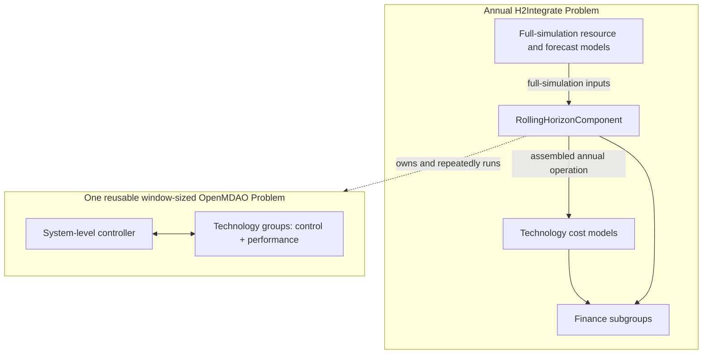

# Rolling-Horizon Architecture Scaffold

This page describes an architecture under active implementation. The existing annual
and `n_steps_per_compute` execution paths are unchanged when rolling horizon is disabled.
The initial solar-battery-demand-grid topology can run with
`rolling_horizon.enabled: true`; unsupported topology still raises explicitly.

## Configuration

Technology definitions remain in the existing technology YAML. A single optional
plant-level block identifies the technologies whose control and performance models
must advance in causal order:

```yaml
rolling_horizon:
  enabled: false
  prediction_horizon: 24
  control_interval: 1
  steppable_technologies: [battery, bat_combiner, electrical_load_demand, grid_buy, grid_sell]
  initial_states:
    battery:
      soc: 0.1
```

`prediction_horizon` is how many timesteps the controller can see. `control_interval`
is how many timesteps are committed before the next solve. Separating these values
supports receding-horizon control where, for example, a controller sees 24 hours but
implements only the first hour.

The planner validates technology names and derives model placement from each existing
technology definition:

| Model role | Planned location |
| --- | --- |
| `dispatch_rule_set` | Window for listed technologies; annual otherwise |
| `control_strategy` | Window for listed technologies; annual otherwise |
| `performance_model` | Window for listed technologies; annual otherwise |
| `cost_model` | Annual parent problem |
| `finance_model` | Annual parent problem |

Intermediate operational technologies must be listed when they transform a flow needed
inside the loop. In example 37, `bat_combiner` belongs in the window because demand uses
its combination of annual solar availability and windowed battery output. The final
`combiner` can remain annual because it aggregates completed trajectories for finance.

## Proposed Hierarchy



The technology remains one configuration concept even though its models execute in two
places. A future role-aware technology factory should construct the window group with
`control_strategy`, `dispatch_rule_set`, and `performance_model`, then construct annual
cost and finance models from the same technology dictionary.

## Window Interface

The nested problem should not expose all internal OpenMDAO variables. Its generated
interface should contain four categories:

1. Design inputs such as capacity, efficiency, and rate limits.
2. Forecast slices such as resource availability, demand, and market prices.
3. Explicit initial and final states such as SOC, inventory, degradation, and controller
   event budgets.
4. Committed operational results such as production, consumption, unmet demand, and SOC.

OpenMDAO `SubmodelComp` supports explicit inner-to-outer aliases for these variables. It
is an optional integration boundary, not the temporal executor: one `SubmodelComp.compute`
call runs the inner problem once. `RollingHorizonController` owns the loop, reuses the same
inner problem, and copies only each control interval into annual output arrays. The current
implementation calls that inner problem directly because state adapters and repeated runs
do not benefit from an additional `SubmodelComp` layer yet.

```text
build_window_problem()
connect_window_technologies()
add_window_controller()
expose_window_problem()

for start in range(0, n_timesteps, control_interval):
  set_window_inputs(start, full_sim_inputs)
    set_initial_state(state)
    run the reusable window problem
    commit_control_interval(start, annual_outputs)
    state = capture_final_state()
```

The final state must represent the end of the committed interval, not the end of the
longer prediction horizon.

## Economic Signals

Controllers should consume decision-time economic signals inside the window:

- Numeric marginal costs and `buy_price` are causal inputs and can be sliced or broadcast.
- Market sell prices are forecasts even when their defaults are stored in a finance-group
  configuration.
- `VarOpEx` and `feedstock` currently derive average marginal cost from completed annual
  production. The planner marks these as economic feedback instead of treating them as
  ordinary window inputs.

A future `MarginalCostProvider` should translate cost configuration into causal unit-cost
signals. ProFAST should not run inside each control interval.

When every feedback variable is represented as an OpenMDAO input or output, the preferred
form is a full-simulation group containing `RollingHorizonComponent` and the components
that update those variables. A cycle between them can use `NonlinearBlockGS` initially,
or Newton methods when useful derivatives are available. Each nonlinear iteration still
runs the complete rolling-horizon operation.

## Current Scaffold

`h2integrate.core.rolling_horizon.create_rolling_horizon_plan` currently provides:

- Validated horizon and technology selection.
- Per-technology part-simulation and full-simulation model-role placement.

`H2IntegrateModel` creates this plan before constructing OpenMDAO groups. The specialized
`RollingHorizonController` now implements window slicing, deterministic end padding,
state transfer through adapters, repeated inner execution, and annual output assembly.
`RollingHorizonComponent` is the literal outer OpenMDAO component that invokes this
controller. It supports one-to-many forecast aliases, static metadata aliases, assembled
annual output aliases, and final-state outputs. Inbound aliases for crossing direct and
combiner connections are generated from plant topology.

The default window factory constructs the initial direct/cable/combiner topology.
`H2IntegrateModel` replaces selected operational roles with the rolling component while
retaining their full-simulation cost and finance roles. Generated outbound aliases feed
cross-boundary topology, grid costs, replacement schedules, and finance. The enabled
Example 37 integration test exercises this path over the complete 8,760-point simulation.
